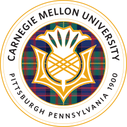

## Scholarships

### 2025-2026 Academic Year

   - **Scholarship:** Carnegie Mellon University INI Fellowship, 2025-2026
   - **Date:** April, 2025
   - **Prize:** $4,000 USD
   - **Award Diploma:** <a href="https://raw.githubusercontent.com/ErwinZhou/pics_home/main/others/issues/not_available.jpg"> View Diploma</a>
   - **Award Certificate:** <a href="https://raw.githubusercontent.com/ErwinZhou/pics_home/main/others/issues/not_available.jpg">EN</a>

### 2023-2024 Academic Year

   - **Scholarship:** Nankai University Gongneng Scholarship, 2023-2024 
   - **Date:** November, 2024
   - **Winning Rate:** Top 3%
   - **Prize:** 5,000 RMB
   - **Award Diploma:** <a href="https://raw.githubusercontent.com/ErwinZhou/pics_home/main/others/issues/not_available.jpg"> View Diploma</a>
   - **Award Certificate:** <a href="../files/certificates/scholarships/2023-2024-CN.pdf">CN</a> / <a href="../files/certificates/scholarships/2023-2024-EN.pdf">EN</a>

### 2022-2023 Academic Year

   - **Scholarship:** Nankai University Academic Excellence Scholarship, 2022-2023
   - **Date:** November, 2023
   - **Winning Rate:** Top 5%
   - **Prize:** 2,000 RMB
   - **Award Diploma:** <a href="../files/certificates/scholarships/2022_2023_Diploma.pdf"> View Diploma</a>
   - **Award Certificate:** <a href="../files/certificates/scholarships/2022-2023-CN.pdf">CN</a> / <a href="../files/certificates/scholarships/2022-2023-EN.pdf">EN</a>

## Others

**Continue to update ...**